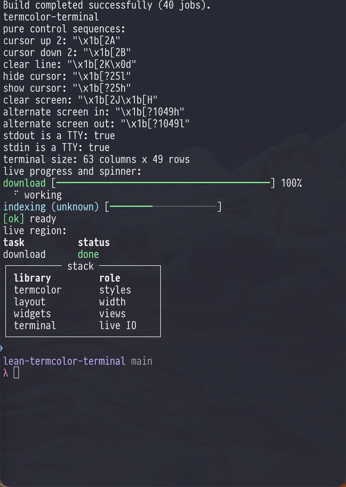

# termcolor-terminal

[](https://github.com/jonaprieto/lean-termcolor-terminal/actions/workflows/ci.yml)
[](lean-toolchain)
[](LICENSE)

Terminal control and live IO helpers for the [`termcolor`](https://github.com/jonaprieto/lean-termcolor)
stack. Pure ANSI sequences are exposed alongside stdout output, flushing, one-line redraws,
multi-line regions, and widget-backed live progress and spinner objects.

```lean
import TermColor.Terminal

open TermColor
open TermColor.Terminal

def main : IO Unit := do
  let region := LiveRegion.start
  let region ← region.updateText (Text.styled "working..." Style.cyan)
  let _ ← region.updateText (Text.styled "done" Style.green)
  let _ ← region.finish
```

`terminalSize` first honors `COLUMNS` and `LINES`. If those are unavailable, it invokes `stty size`
through `/dev/tty` on macOS/Linux and returns `none` when no terminal size is available.

Cursor-control helpers are no-ops when stdout is redirected or `TERM` is `dumb`/`unknown`.
Live objects use newline-separated snapshots in that mode, so pipes and CI logs do not receive
cursor escape sequences. `stdoutSupportsControl` exposes the same policy to callers.

`LiveRegion` redraws a one- or multi-line `Text` value at a cached terminal width, and `LiveProgress`,
`LiveSpinner`, `LiveIndeterminateProgress`, `LiveStatus`, and `LiveTable` connect
[`termcolor-widgets`](https://github.com/jonaprieto/lean-termcolor-widgets) to those live updates.
Styled text is rendered through `TermColor.Detect`, while
[`termcolor-layout`](https://github.com/jonaprieto/lean-termcolor-layout) supplies width-aware
boxes, columns, and the default terminal width. [`argus`](https://github.com/jonaprieto/lean-argus)
uses this terminal layer for command help and completion output.

## TUI input core

`parseKey` decodes complete arrow, Enter, Tab, Escape, Backspace, and character sequences into the
pure `termcolor-widgets` `Key` type. `readKey` reads the same keys directly from a TTY, while
`withRawInput` scopes character-at-a-time mode and restores the previous terminal settings.
`moveFocus` wraps an ordered set of application-owned focus slots.

## Terminal behavior

The live path uses ANSI/VT control sequences on capable TTYs. It degrades to newline-separated
snapshots for pipes, CI logs, `TERM=dumb`, and `TERM=unknown`, keeping redirected output readable
and free of cursor escapes. Terminal sizing uses `COLUMNS` and `LINES` first, then `/dev/tty` where
available.

## Demo

Run the demo from an interactive terminal to enter the direct-key TUI first. It contains `Form`,
`Boxes`, and `About` tabs: `Tab` moves focus, `Left`/`Right` switches tabs or edits controls,
`Enter` activates Save, and `Esc` exits. The `Boxes` tab demonstrates nested and stacked titled
boxes arranged with `Layout.columns`. The demo then continues with live progress, spinner, status,
and table examples. Non-TTY, CI, and forced non-interactive runs show a static control preview and
skip live animations.



Build and run the demo:

```sh
lake build TermColor.Terminal TermColor.Terminal.Properties demo
lake exe demo
```

The separate `TermColor.Terminal.Properties` library machine-checks the pure sequence and live-object laws.
`scripts/check-axioms.py` reports the axioms every one of them depends on and fails the build on
anything unexpected. Laws proved by `native_decide` trust the compiler rather than the kernel, so each
is named in an explicit allowlist instead of passing unnoticed.
Most proofs use kernel `decide`; size parsing and string-heavy redraw cases use `native_decide` because
Lean 4.28 does not reduce those strings in the kernel. CI checks that allowlisted axiom footprint.
Force the static demo with `TERMCOLOR_TERMINAL_NONINTERACTIVE=1 lake exe demo`. A full-screen retained
buffer remains outside this small live output layer.

## License

Apache-2.0.
